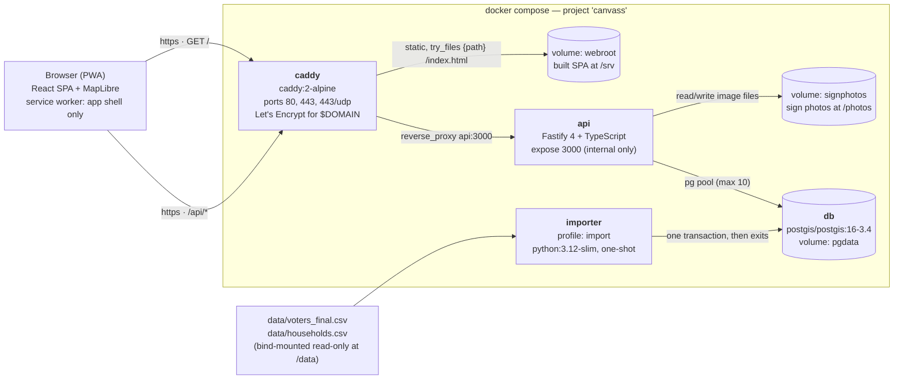
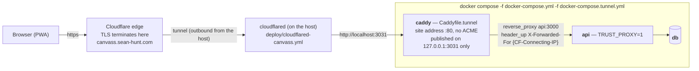

# Architecture & API integration

Developer orientation for `mc-canvass` — the self-hosted voter map / canvassing tool for the Sean Hunt
mayoral campaign (Middlesex Centre, Ontario; election day 2026-10-26).

**What exists today:** Phase 1 (import, login with roles, map / search / stats), Phase 2 (turfs,
assignments, the door screen, follow-ups, activity) and Phase 3 (the offline write queue and turf
cache, the separate sign-photo queue, nearest-first door ordering, the printable turf sheet, the
add-to-home-screen path, and a real tablet layout — §6 and §7), plus three things that were not in
the original plan at all: **lawn signs** with GPS and photos, **doorstep phone/email with
per-purpose consent**, and **optional street-level imagery of a door** (off unless a key is
configured — §5). Phase 4 (coverage reports, CSV export with audit entries, diff-based re-import) is
not started.

This file explains how the pieces fit together. It is not the operator manual and not the API contract:

| Document | Authority for |
|---|---|
| [`../README.md`](../README.md) | Deploy (both modes), `make up` / `make import` / `make migrate`, backups, restore, purge, importer field mapping, the pipeline, the `web/Dockerfile` contract |
| [`../API.md`](../API.md) | The endpoint/role contract — request and response shapes, audit actions, env vars. **Authoritative.** |
| [`../prompt_plan.md`](../prompt_plan.md) | The four phases, what has shipped against each, and what is deliberately deferred |
| [`../CLAUDE.md`](../CLAUDE.md) | Working conventions and the landmines, for anyone changing this codebase |

The voters list is personal information supplied under Ontario's *Municipal Elections Act, 1996*
(s. 23, s. 88). That constraint is the reason for several design decisions called out below —
role-gated serialization, turf scoping for volunteers, an `audit_log` write on every read of personal
data, and a service worker that never caches `/api/*`. The policy itself lives in `../README.md`.

Doorstep phone numbers and email addresses are **not** list data and are governed by a different rule
(consent, and Canada's Anti-Spam Legislation). That is why they live in their own table — see §4.

---

## 1. System overview

The same five-service compose stack runs in **two deployment modes**. They differ only in what Caddy
does: terminate TLS itself, or serve plain HTTP on loopback behind a Cloudflare Tunnel.

### Mode A — public host (`make up`)



### Mode B — Cloudflare Tunnel (`make up-tunnel`, the current setup)

The stack runs on the office Mac, which has no public address. `docker-compose.tunnel.yml` overrides
Caddy's ports (`!override`, so 80/443 stay unbound) and swaps in `Caddyfile.tunnel`.



**Why the header rewrite.** With TLS terminating at the edge, every request reaches the API from the
tunnel's own address. `Caddyfile.tunnel` copies `CF-Connecting-IP` into `X-Forwarded-For`, and the API
runs with `TRUST_PROXY=1`, so `req.ip` is the real client. Without it `audit_log` would record one
meaningless address for the entire campaign — and the audit log is the Municipal Elections Act
artefact, so that is not cosmetic. HSTS is still set in tunnel mode because the browser-to-edge hop is
HTTPS.

A third overlay, `docker-compose.devdb.yml` (`make devdb`), publishes the database on
`127.0.0.1:5443` so the `npm run dev` API and the test suite can reach the one imported copy of the
list rather than a second copy on the same machine. **Never add it on a public host.**

### Common to both modes

Not shown in either diagram: a fifth service, **`web`**, which is **build-only**. It builds the SPA,
runs `sh -c "rm -rf /srv/* && cp -r /app/dist/. /srv/"` into the shared `webroot` volume, and exits;
`caddy` waits on it with `depends_on: service_completed_successfully`. There is no nginx anywhere —
Caddy serves the files itself. See "web/Dockerfile contract" in `../README.md` before touching that
image.

Startup order enforced by `docker-compose.yml`: `db` (healthcheck `pg_isready`) → `api`
(healthcheck `GET /api/health`) → `web` (runs to completion) → `caddy`. The `importer` has its own
compose profile (`import`) so it never starts with the stack; `make import` runs it on demand.

Only Caddy publishes ports. `api` uses `expose`, and `db` has no host mapping unless the devdb
overlay adds one.

Basemap raster tiles are fetched by the browser directly from public OSM / CARTO / Esri endpoints —
they never pass through our stack. Map glyphs are self-hosted from `web/public/fonts` so no font
request leaves the origin.

**The one outbound call the stack itself makes** is street-level imagery, and it is off unless
`STREETVIEW_API_KEY` is set. `GET /api/households/:id/streetview` (`api/src/lib/streetview.ts`)
proxies Google's Street View Static API server-side. The key never reaches the browser, the only
thing sent to the provider is **two numbers** — the door's lat/lon, which came from public county
address data — and the **bytes are never stored, on disk or in memory**. The one thing cached is the
`pano_id` for a coordinate, which is the single carve-out Google's Service Specific Terms §A.3
allows; §3.2.3 forbids storing or caching the imagery itself. See §5.

**Sign photos are files, not rows.** `SIGN_PHOTO_DIR` (the `signphotos` volume in compose,
`../data/sign-photos` locally) holds the image bytes; `sign_photo` holds only metadata. They are
large, never queried, and keeping them as files means `make purge` destroys them with the volumes.

---

## 2. Tech stack

| Component | Technology | Version | Responsible for |
|---|---|---|---|
| Reverse proxy / TLS | Caddy (`caddy:2-alpine`) | 2 | Mode A: Let's Encrypt cert for `$DOMAIN`, HTTP→HTTPS. Both modes: `zstd`/`gzip`, security headers (HSTS, `X-Content-Type-Options`, `Referrer-Policy: no-referrer`, `X-Frame-Options: DENY`, `-Server`), static SPA with SPA fallback, `/api/*` → `api:3000`. Mode B adds the `X-Forwarded-For` rewrite |
| Tunnel (mode B) | `cloudflared` on the host | — | `deploy/cloudflared-canvass.yml`: `canvass.sean-hunt.com` → `http://localhost:3031`. A dedicated tunnel, so stopping it takes only this service offline |
| Database | PostgreSQL in the PostGIS image (`postgis/postgis:16-3.4`) | PG 16 / PostGIS 3.4 | All persistence. Extensions actually used: `pgcrypto`, `citext`, `pg_trgm`. PostGIS is available but **still unused** — see §4 |
| API runtime | Node.js (`node:22-alpine`), ESM, non-root user | 22 | Runs `dist/server.js` on port 3000 |
| API framework | Fastify | ^4.29.0 | HTTP server, hooks, plugin scoping, error handler |
| API plugins | `@fastify/cookie` / `@fastify/helmet` / `@fastify/rate-limit` / `@fastify/multipart` | ^9.4.0 / ^11.1.1 / ^9.1.0 / ^8.3.1 | Signed session cookie; API response headers; 10 req/min/IP on `auth/login` and `auth/accept-invite` (`global: false`, opt-in per route); the one multipart route (sign photos, limits: 1 file, 8 MB) |
| Passwords | `argon2` (argon2id, 19 MiB / t=2 / p=1) | ^0.41.1 | Password hashing and verification |
| DB driver | `pg` (node-postgres) | ^8.13.1 | Pool of 10; no ORM; `int8` and `numeric` type parsers set in `api/src/db.ts` |
| Validation | `zod` | ^3.24.1 | Env contract (`config.ts`), every route's params/query/body, and the GeoJSON polygon schema in `lib/geo.ts` |
| Logging | `pino` (via Fastify) | ^9.6.0 | Request logs with request ids; cookie / authorization / set-cookie redacted; auth routes flagged so bodies are never logged |
| API language / tooling | TypeScript, `tsx` | ^5.7.2, ^4.19.2 | `npm run build` (tsc), `npm run dev` (tsx watch), `npm test` (`tsx --test`, `csv-parse` for the expected counts) |
| SPA framework | React + React DOM | ^18.3.1 | UI |
| Routing | `react-router-dom` | ^6.28.0 | Client routes, incl. `/invite/:token` and `/canvass/:turfId` |
| Server state | `@tanstack/react-query` | ^5.62.0 | All API queries/mutations (`web/src/api/hooks.ts`) |
| Map | `maplibre-gl` | ^5.0.0 | Household points, turf polygons, sign markers, base layers, filters, polygon drawing. ~1 MB — `lazy()`-loaded and manually chunked |
| Web build | Vite (+ `@vitejs/plugin-react`) | ^5.4.11 | Dev server, production build to `/app/dist`, and an inline plugin that emits `sw.js` |
| Importer | Python (`python:3.12-slim`), non-root uid 10001 | 3.12 | One-shot CSV load |
| Importer driver | `psycopg[binary]` | >=3.2,<4 | The importer's only third-party dependency; everything else is stdlib |
| Offline storage (browser) | IndexedDB, no library | — | `web/src/offline/db.ts`: four object stores (`outbox`, `turf_cache`, `meta`, `pending_photos`), database `mc-canvass-field` at version 2, with a loud in-memory fallback — see §6 |
| Street-level imagery (optional) | Google Street View Static API, called **server-side only** | — | `api/src/lib/streetview.ts`. Off unless `STREETVIEW_API_KEY` is set; `STREETVIEW_PROVIDER` is a one-value enum so adding a provider is a code change, not a typo. `app.httpFetch` (decorated in `app.ts`) is the injection point, so no test ever makes a billed call |
| Pipeline / demo seeder | Python 3 on the host | 3.12 | `pipeline/build_lists.py` (needs `openpyxl`), `demo/seed_demo.py` (needs `psycopg`) — neither is containerised, neither runs in production |
| Explainer video | `bash` + `ffmpeg` + Python | — | `demo/make_video.sh` (stills + one narration file per scene, each held for exactly its own audio length), `demo/tts.py` (OpenAI `gpt-4o-mini-tts`, falls back to macOS `say`), `demo/crop_to_content.py` (needs Pillow). Host tooling; nothing in the stack depends on it |
| Migrations | `bash` + `psql` | — | `db/migrate.sh`, invoked by `make migrate` / `make migrate-status`; records each file in `schema_migration` |

Both images build multi-stage and run as non-root. The API image installs `curl` solely for its
`HEALTHCHECK`.

Image handling is deliberately dependency-free: `api/src/lib/images.ts` sniffs JPEG/PNG/WebP magic
bytes and reads the dimensions out of the container header by hand rather than pulling in `sharp`.
Nothing re-encodes on the server — the browser downscales before upload (`web/src/signs/downscale.ts`).

---

## 3. File structure

```
mc-canvass/
├── docker-compose.yml           five services: db, api, web (build-only), caddy, importer (profile "import")
├── docker-compose.tunnel.yml    overlay: Caddy on 127.0.0.1:3031, no 80/443, no ACME
├── docker-compose.devdb.yml     overlay: publishes the database on 127.0.0.1:5443 (never on a public host)
├── Caddyfile                    mode A — TLS + security headers + /api/* proxy + SPA fallback
├── Caddyfile.tunnel             mode B — same routing on :80, plus X-Forwarded-For from CF-Connecting-IP
├── deploy/
│   └── cloudflared-canvass.yml  tunnel ingress template (no secrets; credentials live outside the repo)
├── Makefile                     up / up-tunnel / devdb / migrate / import / backup / restore / purge / psql / test
├── .env.example                 DOMAIN, POSTGRES_PASSWORD, SESSION_SECRET, ADMIN_*, BACKUP_PASSPHRASE, SIGN_PHOTO_DIR
│
├── db/
│   ├── schema.sql               the base schema. Mounted into /docker-entrypoint-initdb.d/ and applied
│   │                            ONLY on the first boot of an empty pgdata volume. It never re-runs.
│   ├── migrations/              every change since then, in filename order
│   │   ├── 001_signs.sql        sign, sign_photo, sign_status
│   │   └── 002_voter_contact.sql voter_contact, contact_channel
│   └── migrate.sh               applies pending migrations, records them in schema_migration
│
├── importer/                    one-shot loader: import.py (single file, stdlib + psycopg), requirements.txt,
│                                Dockerfile. Reads /data/*.csv read-only, writes household/voter/import_run.
│
├── pipeline/
│   └── build_lists.py           rebuilds the importer's two CSVs from the clerk's .xlsx + county open
│                                address data. A RECONSTRUCTION — the original was lost (see §4).
│
├── demo/
│   ├── seed_demo.py             fills a separate `canvass_demo` database with entirely fabricated
│   │                            residents, for screenshots and video (see §9). `make demo` drives it
│   ├── README.md                how to run the demo stack, and the four fabricated accounts
│   ├── make_video.sh            the 60-second explainer: stills + per-scene narration, deterministic
│   ├── tts.py                   one narration line → wav (OpenAI TTS, `say` as the fallback)
│   └── crop_to_content.py       trims the dead margin off a device-width screenshot before scaling
│
├── api/
│   ├── src/
│   │   ├── server.ts            process entry: loadConfig → buildApp → listen, SIGINT/SIGTERM shutdown
│   │   ├── app.ts               builds the Fastify instance: plugins (incl. multipart), error envelope,
│   │   │                        404 handler, session hook, route registration under /api, bootstrapAdmin
│   │   ├── config.ts            zod env contract + shared constants (SESSION_COOKIE, SESSION_DAYS,
│   │   │                        INVITE_DAYS, MIN_PASSWORD); SIGN_PHOTO_DIR and BOUNDARY_PATH live here
│   │   ├── db.ts                pg Pool factory and the q / one / withTx helpers
│   │   ├── auth/                session.ts (cookie ↔ session row, sliding expiry), guard.ts (the global
│   │   │                        onRequest hook + requireAuth / requireRole preHandlers), password.ts
│   │   │                        (argon2id, invite tokens), bootstrap.ts (first-boot admin)
│   │   ├── lib/
│   │   │   ├── serialize.ts     THE role-based field allow-list, for every shape the API returns (§5)
│   │   │   ├── scope.ts         volunteer turf scoping: assertTurfAccess / assertHouseholdAccess (§5)
│   │   │   ├── geo.ts           GeoJSON polygon zod schema + ray-casting point-in-polygon + bbox (§4)
│   │   │   ├── images.ts        JPEG/PNG/WebP magic-byte sniffing and header dimensions (§5)
│   │   │   ├── streetview.ts    the optional third-party door photo, and the whole privacy argument
│   │   │   │                    for why only two numbers leave and nothing is stored (§5)
│   │   │   ├── audit.ts         the AuditAction union and the append-only insert
│   │   │   └── errors.ts        ApiError + badRequest/unauthorized/forbidden/notFound factories
│   │   └── routes/              one Fastify plugin per endpoint group: auth, users, meta, households,
│   │                            search, streets, stats, turfs (+ assignments), contacts (+ follow-ups,
│   │                            activity), signs, voter-contacts, audit, health. SQL lives in the route.
│   └── test/
│       ├── api.test.ts          integration suite against a real, imported database. Two safety
│       │                        rails guard it — see "Landmines" in ../CLAUDE.md before running it
│       └── geo.test.ts          pure unit tests for the point-in-polygon maths (no database)
│
├── web/
│   ├── vite.config.ts           dev server (port + mkcert HTTPS + /api proxy, both overridable by
│   │                            CANVASS_WEB_PORT / CANVASS_API_PORT), manual chunks, and the inline
│   │                            plugin that generates the app-shell service worker at build time
│   ├── src/
│   │   ├── App.tsx              the route table; role gates wrap /turfs, /reports, /stats, /admin/*
│   │   ├── auth.tsx             client-side RequireAuth / RequireRole — cosmetic only, never a boundary
│   │   ├── styles.css           the single stylesheet. Its header documents the FOUR-STOP BREAKPOINT
│   │   │                        SCALE that every media query in the app uses — see §7
│   │   ├── pwa.ts               app-shell service worker registration + the add-to-home-screen offer
│   │   │                        (iOS gets written instructions; it never fires beforeinstallprompt)
│   │   ├── api/                 client.ts (the ONLY fetch wrapper), hooks.ts (every query/mutation),
│   │   │                        types.ts (mirrors API.md)
│   │   ├── pages/               one component per route (Login, Invite, Map, Canvass, DoorScreen,
│   │   │                        Turfs, TurfSheet, Signs, Reports, Stats, Users, Audit, Account)
│   │   ├── offline/             the field layer: db.ts (IndexedDB, no library), outbox.ts (queued
│   │   │                        JSON writes + backoff), photoQueue.ts (the SEPARATE queue for sign
│   │   │                        photo blobs), turfCache.ts (the opened turf's doors), useOutbox.ts
│   │   │                        — see §6
│   │   ├── print/               print.css — the paper turf sheet's rules, scoped behind a body class
│   │   ├── map/                 MapView + style.ts (the whole MapLibre style), palette.ts (colours shared
│   │   │                        with legend and stats), filters, search box, household card, legal list,
│   │   │                        StreetView.tsx (the optional door photo), and the polygon draw tool
│   │   │                        (DrawPolygon/drawGeometry/drawLayers)
│   │   ├── turfs/               turf list, create dialog (streets or polygon), rename dialog, and the
│   │   │                        assign dialog + AssigneeList (add / move / remove a walker)
│   │   ├── canvass/             the door screen: DoorSheet (variant 'sheet' | 'pane', §7), DoorRow,
│   │   │                        SpokeForm, ContactHistory, ContactDetails (phone/email + consent),
│   │   │                        TurfMap, directions.ts (haversine + the map-app link), nearMe.ts
│   │   │                        (nearest-first ordering), useBreakpoint.ts (the tablet stop in TS),
│   │   │                        SyncStatus.tsx (the queue pill and its panel)
│   │   ├── signs/               PlaceSignPanel, PhotoCapture/PhotoStrip, PickupPanel,
│   │   │                        SignRequestsPanel, SignsMap (lazy), geolocation.ts, downscale.ts
│   │   ├── reports/             follow-up queue and volunteer activity panels
│   │   └── components/          Shell (nav), Bars, shared ui primitives, changelog modal
│   ├── public/                  manifest.webmanifest, icons/, self-hosted map glyph fonts/
│   └── tools/                   make_glyphs.py, make_icons.py, e2e.py (Playwright smoke run)
│
├── data/                        mc_boundary.json (tracked); voters_final.csv + households.csv and
│                                sign-photos/ (all git-ignored)
└── backups/                     encrypted dumps from `make backup` (git-ignored)
```

---

## 4. Data model

The base is [`../db/schema.sql`](../db/schema.sql), applied once on the first boot of the `db`
container. **Everything after that is a migration** in `db/migrations/`, applied by `make migrate` and
recorded in the `schema_migration` table that `db/migrate.sh` creates on demand
(`name text PRIMARY KEY, applied_at timestamptz`). Each migration and its bookkeeping row commit
together, so a failure leaves nothing half-applied, and "pending" is simply "a file in
`db/migrations/` whose basename is not a row in that table".

Two migrations have been applied: `001_signs.sql` and `002_voter_contact.sql`. They have to be
applied to `canvass_test` and `canvass_demo` as well, or the test suite and the demo drift out of
shape — `make demo` does exactly that (`schema.sql` into a fresh database, then `migrate.sh`).

```
app_user ──< session                      (ON DELETE CASCADE)
app_user ──< audit_log                    (user_id nullable: failed logins have no user)
app_user ──< turf.created_by, assignment.user_id, contact.user_id,
             sign.placed_by / removed_by, sign_photo.taken_by, voter_contact.collected_by

import_run ──< household ──< voter        (voter.household_id ON DELETE CASCADE)
                   │             │
                   ├─ turf_household      contact.voter_id ─┘  (ON DELETE SET NULL)
                   ├─< contact
                   ├─< sign               (household_id NULLABLE, ON DELETE SET NULL)
                   └─< voter_contact      (household_id NOT NULL; voter_id nullable)

turf ──< turf_household >── household
turf ──< assignment >── app_user          (UNIQUE (turf_id, user_id))
sign ──< sign_photo                       (ON DELETE CASCADE; the FILES are unlinked by the route)
contact ──< sign.requested_from, voter_contact.contact_id   (both ON DELETE SET NULL)

VIEW household_status  = household ⟕ latest contact for that door
VIEW voter_status      = voter     ⟕ latest contact for that voter
```

**Users and sessions.** `app_user` (uuid pk, `citext` email unique, `user_role` enum
`admin|organizer|volunteer`, `password_hash` NULL until an invite is accepted, `invite_token` unique +
`invite_expires`, `active`, `last_login_at`). `session` rows are the sessions themselves — the cookie
value *is* `session.id` — with `expires_at`, `user_agent` and `ip`, cascading on user delete.

**Imports.** `import_run` records `source_label`, `voters_sha256`, `households_sha256`, row counts and
`finished_at`. The importer is idempotent on identical hashes; both `household` and `voter` carry
`import_run_id`, so every row is traceable to the file it came from.

**Households and voters.** `household.id` is the pipeline id (`H-KOMOKA-00123`, `H-LEGAL-0007`), which
is why it is `text` and not a surrogate key. It carries ward/community/postal/locality, the parsed
civic address (`civic_num`, `street`, `street_type`, `street_dir`, `unit`), `lat`/`lon`, geocoding
provenance (`addr_match`, `record_quality`), the `is_legal` / `is_institution` flags, the denormalized
counts (`n_voters`, `n_nonresident`, `n_po_box`) and the walking-order keys (`street_sort`,
`num_sort`). `voter` holds split name fields plus `name_raw` for traceability, `resident_class`, the
mailing fields, and `natural_key` (UNIQUE) — the stable identity used to match voters across
re-imports. Indexes: ward, community, `(lat, lon)`, `(street_sort, num_sort)`, and GIN trigram indexes
on `household.address` and `voter.full_name` for `/api/search`.

The current load is **7,140 households and 16,892 electors**, of which **7,067** have coordinates and
are on the map, **70** are legal descriptions (concession/lot, no civic address, no map point), **3**
would not geocode at all, and **11** are flagged institutions. The 73 households with no `lat`/`lon`
are why several features have an honest "nothing to show here" branch rather than an error — the map
lists them separately (`GET /api/households/legal`), and `GET /api/households/:id/streetview`
404s on them before it ever calls the provider.

**Where the CSVs come from.** `pipeline/build_lists.py` rebuilds `voters_final.csv` and
`households.csv` from the clerk's `.xlsx` and the county's open address points. It is a
**reconstruction** — the original pipeline was not kept — so its derived columns are produced by the
rules documented in the script rather than recovered. It reproduces the original's published figures
for voters, legal descriptions, institutions and duplicate entries, but `resident_class` differs
materially: it classifies 390 non-residents where the original counted 337. Treat the non-resident
layer as indicative and confirm at the door. The counts are also why two numbers on the same subject
disagree by design: `household.n_nonresident` sums to 394 because the pipeline counts the 4 `unknown`
voters as well, while `/api/stats/overview` counts `nonresidents` strictly as
`resident_class = 'non-resident'` (390).

**Why lat/lon and not PostGIS geometry.** The production image *is* `postgis/postgis:16-3.4`, but the
schema stores two `double precision` columns instead of a `geometry` point, so the same `schema.sql`
also runs on a bare PostgreSQL 16 in development and CI. Phase 2 did not change that: turf
materialisation is a cheap bbox `BETWEEN` in SQL followed by a ray-casting point-in-polygon test in
TypeScript (`api/src/lib/geo.ts`), which is one query plus a few thousand comparisons per turf save —
well under a millisecond over ~7k rows. `CREATE EXTENSION postgis` has never been run. It is there if a
genuinely spatial query ever needs it.

**Canvassing (Phase 2, now live).** `turf` (name, optional `ward` **label**, GeoJSON polygon in a
`jsonb` column when drawn, `created_by`, `archived`), `turf_household` (with `walk_order`),
`assignment` (turf ↔ user, `open|in_progress|done`, `UNIQUE (turf_id, user_id)`) and `contact`
(append-only canvass events: `contact_result` enum, 1–5 `support`, issue tags, the four flags, note,
`turf_id`, plus a UNIQUE `client_id` idempotency key — §6).

Two rules in `turf` are worth knowing before you touch the builder:

- **`ward` is a label, never a filter.** A rural road that crosses a ward line appears as several rows
  in `GET /api/streets`, and a turf that stops halfway down a road at an invisible boundary is worse
  to walk than one that takes the whole road. The same applies to a drawn polygon: the geometry the
  organizer drew is the selection.
- **`walk_order`** is assigned by the same window function in both branches —
  `row_number() OVER (ORDER BY street_sort, num_sort, id)` — so the door list always comes out in
  walking order regardless of how the turf was built.

**Lawn signs (`001_signs.sql`).** `sign` (`sign_status` enum `requested|placed|removed|missing|damaged`,
`lat`/`lon`, `accuracy_m`, free-text `label`/`size`/`note`, `permission_by`, the requested/placed/removed
stamps, a UNIQUE `client_id`) and `sign_photo` (metadata only: `path` relative to `SIGN_PHOTO_DIR`,
`content_type`, `bytes`, `width`/`height`, `taken_by`).

`sign.household_id` is **nullable on purpose**: road allowances, corners and business frontages are not
doors on the voters list, and what actually matters months later is the coordinate the volunteer stood
at. Ontario municipal sign by-laws require signs down within a set period after election day; a sign
nobody can find is a fine, which is the whole reason for the GPS fix, the reported accuracy and the
photo. `POST /api/signs` refuses a coordinate outside a Middlesex Centre bounding box — a bad fix sends
the pickup crew to the wrong concession while the real sign stays up.

**Doorstep contact details (`002_voter_contact.sql`) — and why it is not on `voter`.** The clerk's list
carries no phone numbers and no email addresses. Everything in `voter_contact` was given directly by
the person at the door, for a purpose they were told about, so it is a different kind of data with
different rules:

- it must never be merged back into an export of the voters list;
- consent is **per purpose** (`consent_gotv`, `consent_updates`, plus a free-text `consent_note`)
  because one "ok to contact" boolean cannot answer "did they agree to *this*?";
- **withdrawal is stamped, not deleted.** `withdrawn_at` is set and the row stays. A deleted row is
  simply re-collected at the next canvass, and the point is to remember that somebody asked us to
  stop. `DELETE` exists but is organizer/admin only and is for a genuinely wrong number;
- `contact_id` links the value back to the doorstep conversation it came out of, so the consent has a
  context, and `collected_by`/`consented_at` record who took it and when. That is what makes a consent
  defensible under Canada's Anti-Spam Legislation if it is ever questioned.

`UNIQUE (household_id, channel, value)` is why values are normalised before storage — phone to `+1`
NANP form, email lower-cased — so the same number offered twice in two formats is one row. A partial
index `WHERE consent_gotv AND withdrawn_at IS NULL` is the GOTV send list.

It is still destroyed by `make purge` with everything else.

**Audit.** `audit_log` (bigserial, `at`, nullable `user_id`, `action`, `target`, `detail` jsonb, `ip`)
is append-only and indexed on `(user_id, at DESC)`. The full action union is in
`api/src/lib/audit.ts` — extend it there rather than passing a loose string. Every read of personal
data writes a row here; that is a Municipal Elections Act requirement, not a nice-to-have.

Two groups of actions are worth knowing about:

- **`voter_contact` audits changes, not only reads** (`collect_voter_contact`,
  `view_voter_contacts`, `update_voter_contact`, `withdraw_voter_contact`, `delete_voter_contact`,
  `view_gotv_list`). A consent is only defensible if the log can say what was agreed, when, and who
  took or changed it.
- **`view_streetview` audits both outcomes.** Looking at a photograph of somebody's front door is a
  read of that door — and it is the only action in this API that sends anything to a third party, so
  the "there was no imagery here" case is audited too (`detail.available: false`). Every 200 is a
  fresh billed request, because the bytes are never kept: one row, one charge.

Note what is *not* audited, and why: `GET /api/signs` and `/api/signs/pickup` are campaign
logistics, but `GET /api/signs/requests` reads doors off the list and so audits like any other
personal-data read. `GET /api/activity` returns aggregates only.

**Views.** `household_status` and `voter_status` are `LEFT JOIN LATERAL … ORDER BY at DESC LIMIT 1`
over `contact`. They are still **unused by every route** — `routes/households.ts`, `routes/turfs.ts`
and `routes/contacts.ts` all inline the identical lateral subquery, partly so the volunteer path can
vary the join. They remain the documented shape. If you change one, change the other or drop the views.

---

## 5. API integration

### Transport

The SPA and the API are **same-origin**. `web/src/api/client.ts` is the only place that calls `fetch`:
it prefixes every path with `/api`, sends `credentials: 'same-origin'`, and never sets a base URL or an
`Authorization` header. In production Caddy routes `/api/*` to `api:3000`; in development Vite proxies
`/api` to the local API. There is no CORS configuration anywhere because there is no cross-origin case.

The exceptions to "everything is JSON" are all images: `POST /api/signs/:id/photo` is
`multipart/form-data`, `GET /api/signs/photo/:photoId` streams stored bytes with
`Cache-Control: private`, and `GET /api/households/:id/streetview` streams proxied bytes with
`Cache-Control: private, max-age=900`. The multipart post is also the one route the SPA does *not*
send through `client.ts` — `web/src/offline/photoQueue.ts` builds the `FormData` and the `fetch` by
hand, then converts the failure into the same `ApiError` so it classifies like everything else (§6).

### Session cookie

Login sets `canvass_sid` — the `session.id` UUID, signed by `@fastify/cookie` with `SESSION_SECRET`:

| Attribute | Value | Set in |
|---|---|---|
| Name | `canvass_sid` | `api/src/config.ts` (`SESSION_COOKIE`) |
| `HttpOnly` | true | `setSessionCookie`, `api/src/auth/session.ts` |
| `Secure` | `config.COOKIE_SECURE` (default `true`; `false` only for plain-HTTP dev) | same |
| `SameSite` | `Lax` | same |
| `Path` | `/` | same |
| Lifetime | 30 days, **sliding** | `SESSION_DAYS`; bumped in `loadSession` |

The sliding expiry is cheap by construction: `loadSession` pushes `expires_at` back to 30 days only
when fewer than 29 remain, so at most one `UPDATE` per session per day, fire-and-forget. Server-side
session rows mean revocation is real — deactivating a user or changing a password deletes rows
(`destroyOtherSessions`) and every other device is logged out on its next request.

### Error envelope

Every failure is `{ "error": { "code": "...", "message": "..." } }`, produced in one place —
`app.setErrorHandler` in `api/src/app.ts`:

- `ApiError` (from `api/src/lib/errors.ts`) → its own status and code. Throw these; never reply with an
  ad-hoc error shape.
- `ZodError` → `400 validation_error` with the joined issue paths.
- Anything ≥ 500 → logged with the request id, returned as `500 internal_error` with a fixed message.
- Fastify's own 4xx (bad JSON, payload too large) keep their status with a lower-cased code.
- The 404 handler and the rate limiter's `errorResponseBuilder` (`429 rate_limited`) feed the same shape.

The client mirrors it: `client.ts` parses `error.code` / `error.message` into its own `ApiError`
(`{ status, code, message }`), falls back to `http_<status>` when a body is missing, and notifies
`onUnauthorized` listeners on any 401 so the app can drop to `/login`.

### The role model

`admin > organizer > volunteer`, ranked once in `serialize.ts` (`roleAtLeast`) and mirrored —
cosmetically — in `web/src/auth.tsx`. The client gates are navigation sugar; **the API is the
boundary**.

There are now **two** enforcement mechanisms, and most Phase 2 routes use both:

1. **Guards** — a route opts in with a preHandler: `requireAuth` (any signed-in user) or
   `requireRole('organizer' | 'admin')`. Endpoints with no guard: `POST /api/auth/login`,
   `POST /api/auth/accept-invite`, `POST /api/auth/logout` and `GET /api/health`.
2. **Turf scope** (`api/src/lib/scope.ts`) — for everything a volunteer *can* reach that names a
   household or a turf. `assertTurfAccess` and `assertHouseholdAccess` return immediately for
   organizers and admins; for a volunteer they check `assignment`/`turf_household` and otherwise throw
   `403 not_your_turf`. `PATCH /api/assignments/:id` has its own equivalent (`not_your_assignment`).

   Scope is checked **before** the row is loaded, so an out-of-turf volunteer gets a 403 and never a
   404 that would tell them whether the id exists.

Phase 1 left a volunteer with anonymous map points and nothing else. Phase 2 widens that by exactly one
rule: **a volunteer may read and write the doors of the turfs they are assigned to, and nothing else.**
Municipality-wide reads (`/api/search`, `/api/streets`, `/api/stats/overview`,
`/api/households/legal`, `/api/follow-ups`, `/api/activity`, `/api/voter-contacts/gotv`) stay
organizer-or-above.

### `api/src/lib/serialize.ts` — the single enforcement point

Every row that leaves the API passes through a function here: `serializeVoter`, `serializeHousehold`,
`serializePointProps`, `serializeDoor`, `serializeContact`, `serializeVoterContact`,
`serializeGotvContact`, `serializeSign`, `serializeSignPhoto`, `serializePickup`,
`serializeSignRequest`, `serializeUser`, `serializeUserListRow`.

These are **explicit allow-lists**: they build a new object by picking keys, they never delete keys
from a row. That is deliberate — a column accidentally added to a SQL projection (or an insert's
`RETURNING *`) cannot leak, because nothing copies unknown keys through.

Fields a volunteer **never** receives:

| Field | Source | Stripped by |
|---|---|---|
| `mailing_address` | `voter` | `serializeVoter` |
| `mail_city` | `voter` | `serializeVoter` |
| `mail_postal` | `voter` | `serializeVoter` |
| `resident_class` | `voter` | `serializeVoter` |
| `n_nonresident` | `household` | `serializeHousehold` |
| `n_po_box` | `household` | `serializeHousehold` |
| `nonres` (= `n_nonresident`) | map point props | `serializePointProps` |
| `q` (= `record_quality`) | map point props | `serializePointProps` |

Two Phase 2 refinements to that table:

- **`status` on map points is now scoped, not withheld.** A volunteer gets `status` (the door's latest
  contact result) for doors inside a turf assigned to them, so they can colour their own turf, and
  nothing at all for every other door. `GET /api/households/points` materialises that scope once in a
  CTE and the lateral join is guarded by it, so the out-of-turf result is never fetched in the first
  place — not fetched, then stripped.
- **`GET /api/users` is organizer-and-above**, because the organizer needs names to fill the "assign a
  turf" picker. `serializeUserListRow` gives a non-admin only `{ id, name, role, active }` — no email,
  no login times, no invite state.

Some shapes carry no list data at all and so have no role branch — `serializeContact`,
`serializeSign`, `serializeVoterContact`. They are still allow-lists, for the same reason: the sign
queries join `household`, and a widened join must not become a widened response by accident.

**When you add a personal-data field**, add it to the right role branch in `serialize.ts`, update
`API.md`, and extend the restricted-key assertions in `api/test/api.test.ts`.

### Street-level imagery: the first of two third-party calls

`GET /api/households/:id/streetview` returns a photo of the door so a canvasser can recognise the
house — is it the one behind the hedge, are there steps, is there a gate. It is **off unless
`STREETVIEW_API_KEY` is set**, which is the default: the stack makes exactly two outbound calls and
both are off unless configured, so a campaign that wants to make none simply sets no keys. The design in `api/src/lib/streetview.ts` follows
from s. 23(8) of the *Municipal Elections Act* ("shall not provide it to any other person"):

- **Only coordinates leave the building.** Never a name, an address string, or a household id. A
  door's lat/lon came from Middlesex County's public open address data; who lives there did not.
- **The key never reaches the browser.** A key in client JavaScript would be a billing risk *and* a
  disclosure — the requests would carry the campaign's `Referer`, tying "which doors, in what order,
  by whom" to the campaign. Proxied, the provider sees one server asking about locations.
- **The imagery is never stored — not on disk, not in memory.** A directory of 7,000 house photos
  keyed to the voters list is exactly the artefact s. 23 exists to prevent, and Google's Maps
  Platform ToS §3.2.3 bars pre-fetching, storing and caching it in any case. The only cached value
  is the `pano_id` (or its absence) for a coordinate — a bounded, expiring, in-process map — because
  the Service Specific Terms §A.3 name `pano_ID` values as the one thing that may be kept.
- **The free metadata endpoint is checked first**, so a concession road with no imagery costs
  nothing and can answer with a truthful 404 instead of a billed grey placeholder.
- **Guarded like the door itself**: `requireAuth` plus the same `assertHouseholdAccess` used by
  `GET /api/households/:id`, checked before the row is read. On top of that a **per-user** rate limit
  (40/min, keyed on `req.session.user.id`, not the IP — a canvassing team shares one LTE NAT) and a
  hard `w`/`h` cap of 640, because every distinct pixel size is a separately billed image.

`app.httpFetch` is decorated in `app.ts` and injectable, so the test suite exercises this path
without ever making a real, billed call. On the client, `web/src/map/StreetView.tsx` is a plain
`` at our own endpoint — the cookie rides along, there is no blob dance, and 503 (not
configured) and 404 (no imagery) both render as *nothing at all*, because both mean the same thing
to a canvasser. It renders the required Google attribution, and offers no download, share, or
open-in-new-tab: this is a photograph of an elector's house.

### The advice layer: the second third-party call

`api/src/lib/advice.ts` posts the reachability report to Anthropic so the numbers come back as
prose, on `/reports?tab=unreachable`. **Off unless `ADVICE_API_KEY` is set**, and the report renders
its own written guidance without it — which is why the feature is useful with the key absent.

The s. 23(8) argument that shapes `streetview.ts` applies here with more force, because a row in a
prompt is the list "provided to another person" as plainly as anything could be:

- **Only counts leave.** `AdviceInput` has no field that can carry a row — it is category codes and
  integers. `assertNoPersonalData()` re-checks the serialised payload before it is sent, because
  "the type says it is safe" stops being true the day someone widens the type. The suite asserts the
  outgoing body against real elector names and addresses from the loaded database.
- **The key is server-side only** and never reaches the browser.
- **Cached on a hash of the exact facts sent**, so opening the report three times while planning
  bills once, and the advice changes when — and only when — the numbers do.
- **Every failure path returns null.** The numbers are the product and the prose is a garnish; a
  provider outage must not take the report down.
- It goes through `app.httpFetch` like Street View, so no test ever makes a billed call.

### Endpoint groups

Summary only — [`../API.md`](../API.md) is the contract.

| Group | Prefix | Minimum role | Notes |
|---|---|---|---|
| Health | `/api/health` | none | `{ ok, db, import_id }`; the compose healthcheck. 503 when the DB is down |
| Auth | `/api/auth/*` | none / any | `login`, `logout`, `me`, `accept-invite`, `change-password`. `login` and `accept-invite` are rate-limited 10/min/IP |
| Users | `/api/users*` | list: organizer · invite/reinvite/patch: admin | Invite tokens are stored sha256-hashed; the raw token appears only in `invite_url` |
| Reference | `/api/meta` | any | wards, communities, latest import, and the municipal boundary polygon read once at boot from `BOUNDARY_PATH` |
| Households | `/api/households/*` | `points`: any · `:id` and `:id/streetview`: any (**turf-scoped**) · `legal`: organizer | `points` returns `application/geo+json`, all matching households in one payload, `Cache-Control: private, max-age=60`. `:id/streetview` is image bytes, `503 streetview_disabled` when no key is configured, `404 no_imagery` where there is no photo — see above |
| Search | `/api/search` | organizer | trigram + substring over `voter.full_name` and `household.address`. Audited |
| Streets | `/api/streets` | organizer | one row per street × ward × community; the turf builder's input |
| Turfs | `/api/turfs*` | organizer, except `:id/doors`: any (**turf-scoped**) | create from `streets` **or** `polygon` (exactly one), patch (rename/archive), delete, assign/unassign. A turf can carry several assignees (a long road split between two walkers), so `web/src/turfs/AssigneeList.tsx` lists each one with its own Move and Remove. **There is no "move" endpoint** — the client does assign-then-unassign, in that order deliberately: if only one call lands, one person too many is fixable in a tap, whereas an unassign alone leaves doors with nobody walking them and nobody told. When the second call fails, `AssignDialog` says so in those words and drops into the remove step rather than reporting a move. `:id/doors` is the door screen and audits once per view, not once per door |
| Assignments | `/api/assignments/*` | any | `mine` (archived turfs dropped); `PATCH :id` sets status and a volunteer may only touch their own |
| Contacts | `/api/contacts`, `/api/follow-ups`, `/api/activity` | contacts: any (**turf-scoped**) · follow-ups, activity: organizer | `POST /contacts` is append-only, multi-voter and idempotent — §6. `follow-ups` = doors whose *most recent* contact asked for one |
| Lawn signs | `/api/signs*` | any, except `DELETE /:id` and `DELETE /photo/:photoId`: organizer | `POST` is idempotent and rejects out-of-area coordinates; `pickup` is the retrieval worklist; `requests` is the one voter-data endpoint here and is turf-scoped + audited |
| Voter contacts | `/api/voter-contacts*` | any (**turf-scoped**), except `gotv` and `DELETE`: organizer | per-purpose consent; PATCH records withdrawal; `gotv` is the send list and is audited on every call |
| Stats | `/api/stats/overview` | organizer | totals, per-ward, per-community, quality, household size, and live canvass numbers |
| Reachability | `/api/stats/reachability` | organizer | why part of the list cannot be reached. **Aggregates only** — no name, address or id, asserted in the suite — which is what makes it safe to hand to the advice layer. Every category declares which channel it blocks (`door` / `mail` / `gatekeeper`), because "unreachable" is not one thing: `po_box_only` is 306 doors that are all perfectly knockable. `combined.households_blocked` is door-only and de-duplicated; nothing in the response is the sum of the rows above it. Audited as `view_reachability` |
| Turf shapes | `/api/turfs/shapes` | any (**scoped**) | the turf overlay on the main map. A volunteer gets only their assigned turfs; an organiser gets all of them with `mine` set on their own — a WHERE clause, not a filter after loading. A name, a shape and two counts, no door list, so fetching the whole municipality is not a bulk read. `approx: true` means the shape was derived from the turf's doors (a padded convex hull) rather than drawn, which can cover doors that are *not* in the turf — the map draws those dotted and says so |
| Audit | `/api/audit` | admin | reverse-chronological, keyset-paged on `before=<id>`, filterable by `user_id` / `action` |

### Client-side caching and the service worker

TanStack Query holds API responses in memory only. The service worker generated by the inline Vite
plugin precaches the app shell (index.html, the hashed bundles, icons, map glyph fonts) and **returns
early for any URL under `/api/`**, so no voter data is ever written to the browser's Cache Storage.
Cross-origin requests (basemap tiles) are left to the browser cache. Navigations are network-first with
the cached shell as the offline fallback. `web/src/pwa.ts` registers it (production only) and owns the
add-to-home-screen offer: it intercepts `beforeinstallprompt` on Chrome/Edge, and because iOS Safari
never fires that event — and iPhones are most of the phones this runs on — it shows written
instructions there instead, after a delay and never on `/login` or `/invite`.

`localStorage` holds UI preferences only — the map's base layer (`web/src/pages/MapPage.tsx`), the
door-order toggle (`web/src/canvass/nearMe.ts`) and the install banner's "not now"
(`web/src/pwa.ts`), each wrapped in try/catch so private browsing does not crash the app. The places
personal data is deliberately persisted on a device are both in IndexedDB and both scoped and
clearable from one button: the **turf cache** and the **held sign photos** — see §6.

---

## 6. The offline / idempotency contract

This is the least obvious thing in the system. It has one real gotcha on the server (derived keys)
and one on the client (there are **two** queues, and only one of them counts towards the pill).

**Why it exists.** Volunteers are on rural roads with one bar. A door result submitted over a dying
connection may or may not have landed; the phone has to be able to re-send without planting a second
knock (or a second lawn sign) in the database.

**The mechanism.** `contact.client_id` and `sign.client_id` are `text UNIQUE`, nullable. Both write
endpoints insert with `ON CONFLICT (client_id) DO NOTHING` and then read back what is actually stored,
inside the same transaction. NULLs never conflict in Postgres, so the same statement serves both the
keyed and the unkeyed case.

**Who mints the key.** The client, per submission: `crypto.randomUUID()` in `useRecordContact`
(`web/src/api/hooks.ts`) and `usePlaceSign`. The submitted body is kept in a ref
(`web/src/canvass/DoorSheet.tsx`, `web/src/signs/PlaceSignPanel.tsx`) so the retry button re-sends the
**same** key.

**The status code tells you what happened.** `201` when at least one row was created, `200` when every
row already existed. A replay is not re-audited — it is not a new door knock.

### The derived-key gotcha

`POST /api/contacts` writes **one `contact` row per named voter**, in one transaction, sharing the
door-level fields (result, flags, note). That is what makes "he is a 5, she is a 2" — the usual outcome
of a two-person doorstep — expressible at all, because `voter_status` takes the latest row *per voter*.

But `client_id` is UNIQUE, so N rows cannot all carry the one submitted key. The server therefore
derives a key per row:

```
named voters:  client_id  =  "<submitted client_id>:<voter_id>"     (one row per voter)
nobody named:  client_id  =  "<submitted client_id>"                (one row, voter_id NULL)
```

Consequences worth knowing before you write anything that talks to this endpoint:

- **The key you sent is not the key stored** when voters are named. A client that looks up its own
  submission by the verbatim key it minted will not find it. Match on the prefix, or on the returned
  rows' `client_id`.
- **A retry that adds a person is handled, not rejected.** The rows already stored conflict and are
  skipped, the new person's row inserts, and the response re-reads the full stored set for the whole
  key list — so the client sees all of them, ordered as it named them.
- `voter_id` and `voter_ids` are merged and de-duplicated (`voter_id` is just the one-element form),
  capped at 12 named voters per door.
- `supports` is a per-voter map that wins over the scalar `support`. Naming a support level for a voter
  who is not on the contact is a `400 support_voter_not_named` rather than a silent drop — a dropped
  support level is a wrong canvass number three weeks later.
- Every optional field is `.nullish()`, not `.optional()`: a serialised door form sends `null` for the
  boxes nobody ticked, and null and absent both mean "use the column default".

`POST /api/signs` has the same contract with one row, so no derivation: the key is stored exactly as
submitted.

### The client side of it: `web/src/offline/`

The Phase 3 field layer is the consumer this contract was designed for. It is **two queues**, not
one, plus the turf cache.

- **`db.ts`** — IndexedDB in about a hundred lines, database `mc-canvass-field`, no library. Four
  object stores: `outbox`, `turf_cache`, `meta` and `pending_photos`. `localStorage` was rejected
  because it is synchronous (it would block the thumb tap that records a door), string-only, and
  shares a ~5 MB origin budget that one 300-door turf would eat; it also cannot hold a `Blob`, which
  IndexedDB does natively. Each store is keyed by an in-object field, so a put is an upsert. The
  version is **2** — `pending_photos` was added there, and `onupgradeneeded` creates only what is
  missing, so a phone already holding a v1 queue keeps every queued door across the upgrade. There
  is an in-memory fallback for browsers that refuse to open a database at all (Safari private
  browsing, some webviews, another tab blocking the upgrade) — and the UI says so loudly
  (`snapshot.durable === false`), because "saved" would otherwise be a lie past the next reload.
- **`outbox.ts`** — every canvass write (`/contacts`, `/signs`) goes through `submitOrQueue`: try it
  now, and if the *network* was the reason it failed, keep the exact body and replay it. Exponential
  backoff from 5 s to 5 min, capped at 20 attempts, after which the entry is *parked* (`rejected` or
  `stalled`) and shown to the volunteer — never silently dropped. A definite refusal (400/403/404) is
  re-thrown at the door rather than queued: the volunteer is still standing there and can act on it.
  A 401 is queued, not parked — the session merely expired. Flushes are sequential and oldest-first
  (one bar of signal does not get faster with six sockets), and `syncing` is claimed before the first
  `await` so an `online` event cannot double-send.
- **`photoQueue.ts`** — the separate queue, described below.
- **`turfCache.ts`** — the doors response for a turf that was actually opened, so `/canvass/:turfId`
  still works with no connection.
- **`useOutbox.ts`** — `useSyncExternalStore` bindings (`useOutbox`, `usePhotoQueue`,
  `usePendingPhotosFor`, `useQueuedResults`); subscribing is what starts a queue.

Three things here follow directly from the contract above and are easy to get wrong:

- **`client_id` is generated once, when the write is first attempted, and stored with the body.**
  `useRecordContact` and `usePlaceSign` mint it with `crypto.randomUUID()`; the body is kept in a ref
  in `DoorSheet` / `PlaceSignPanel` so a retry re-sends the same key. Regenerating it on retry would
  turn one door into two, so `enqueue` refuses outright to store an entry with no `client_id`.
- **The queue never reconciles on the server's echo.** Because the API derives
  `<client_id>:<voter_id>` for a multi-voter contact, the `client_id` that comes back is not the one
  that was sent. Entries are keyed by the id the client generated (`entry.id` *is* the `client_id`);
  the response body is read for its data and — for a sign — for one other thing, below.
- **A queued write must not claim it was recorded.** `usePlaceSign` returns
  `{ sign, queued: true }` with a locally-built row when the write went to the queue, so the sign
  screen says "waiting to sync" rather than showing a server row that does not exist yet.

`useDoors` is where the cache is written, and its failure branch is deliberate: `401`/`403`/`404` are
*definite answers about this turf* and are shown as errors, while a dead radio or a `502` from a
restarting API falls back to the cached copy (flagged `from_cache` with a `cached_at`). The query
runs with `networkMode: 'always'` (TanStack otherwise pauses when the browser reports itself offline,
hiding the cache behind a spinner in exactly the situation it exists for) and `retry: false`. The
same `networkMode: 'always'` is on the two write mutations, for the same reason. `useOfflineSync`
subscribes to `onSynced` and invalidates the door, contact, assignment and sign queries once a flush
lands, so a volunteer coming back into signal is not left looking at pre-sync numbers.

### The second queue: sign photos (`photoQueue.ts`)

A sign goes up on a concession road with no bars. The placement survives — the outbox replays the
JSON — but the photo is the half that actually finds the sign again in November, and
`POST /api/signs/:id/photo` needs a **server id that a queued sign does not have yet**. Read the file
header before changing it; the short version:

- **It is not an outbox entry type.** The outbox is a JSON queue (`body: Record<string, unknown>`
  through `api.post`) whose entries are rendered one by one in the sync panel, where the counts drive
  the pill a volunteer reads as "how many doors are still on my phone". Teaching it to carry image
  bytes would mean a union body type through every consumer, an 8 MB blob sharing a retry budget with
  400-byte door records, and photos silently changing what the door-canvassing pill says.
- **It is keyed by the sign's `client_id`,** because that is the only identifier that exists when the
  shutter is pressed. `sign_id` is `null` until it is known, and a photo with a null `sign_id` is not
  uploadable — it is *waiting*, not failing.
- **The hand-over is an explicit call, not a timer or a subscription.** `outbox.flush()` calls
  `adoptSignId(entry.id, res.sign.id)` with the `client_id` **it** generated and the id the server
  just returned; `adoptSignId` stamps the waiting photos and resets their attempt counts. The
  dependency is one-way (outbox → photos), so there is no import cycle and nothing has to be mounted
  for it to happen. A surprising response body is not fatal: the sign is placed either way and the
  photo stays visibly held.
- **Same contract, its own classifier.** Backoff, parking and "never drop anything on the app's own
  initiative" match the outbox, but this endpoint's 4xx set is its own — a `413 file_too_large` or
  `400 unsupported_image` is a permanent verdict on these exact bytes, and a `404` means the sign row
  is gone. Uploads are the one route that bypasses `client.ts`: `FormData` and `fetch` by hand, with
  the failure converted into an `ApiError`.
- **Bounded, and refused out loud.** 20 photos / 32 MB held, 8 MB each (the API's own ceiling).
  Refusals are *returned*, not thrown, so the volunteer is told while still standing at the sign.
- **Deleted the moment they land.** A sign photo is a photograph of somebody's house. It goes on a
  successful upload, when the sign it belongs to is discarded (`discardEntry` on a `/signs` entry
  calls `discardPhotosFor`), and with "Clear saved turf data".

### The two deliberate exceptions to "never cache `/api/*`"

The service worker still never caches `/api/*`. Two stores hold personal information on a
volunteer's phone anyway, and both are narrow on purpose.

`turf_cache` is voters-list data — personal information under the Municipal Elections Act:

- nothing is cached until a turf is actually **opened** (`useDoors` writes it; nothing else does);
- only turfs the API agreed to serve that user, which for a volunteer is only their own.

`pending_photos` holds pictures of electors' houses, for as long as it takes to upload them and no
longer.

One visible **"Clear saved turf data"** control in the sync panel clears **both** —
`clearTurfCache()` calls `clearPendingPhotos()` — because a volunteer who says "clear this phone"
means that too and must not have to discover a second store. The photo screen says so at capture
time rather than leaving it to be found afterwards.

`make purge` shreds the server after election day but cannot reach a phone. That is precisely why
these stores are small, opt-in-by-use and clearable from the screen the volunteer already has open.

---

## 7. Layout: the breakpoint scale, and the paper fallback

This is a cross-cutting contract, not a detail: **there are four stops and no fifth number.** They
are documented at the top of [`web/src/styles.css`](../web/src/styles.css), and every media query in
that file, in `canvass/canvass.css` and in anything added later uses one of them. Everything is
written phone-first — the unqualified rules *are* the phone, and each stop only says what extra width
buys.

| Stop | Query | What it is for |
|---|---|---|
| Phone | (none) | The baseline, 320–719px. One column, thumb-zone actions |
| Compact | `max-width: 479.98px` | iPhone SE/mini and iPadOS Slide Over. Tighten labels and numbers; **never** shrink a tap target |
| Tablet | `min-width: 720px` | Room for two panes. 720 rather than 744 so it is a width and not a device — low enough to catch an iPad mini in portrait, high enough to stay above the widest iPadOS Split View half (~678px), which genuinely is phone-shaped |
| Desktop | `min-width: 1100px` | Mouse and keyboard, or an iPad in landscape. The top-bar nav (up to nine links plus a name) only fits from here |

Two height qualifiers ride along, and there are no others: `and (min-height: 600px)` is added to the
tablet stop by anything that needs **two panes** (a phone on its side is 844×390 — past the width and
still a phone; every tablet's short side is 744 or more), and
`(orientation: landscape) and (max-height: 500px)` is the phone on its side, the one case where
height is what has run out.

Two things the widths alone will not tell you:

- **A tablet is a touch device.** `var(--tap)`, thumb-zone placement and hover-free affordances hold
  at every width, so **density is never tightened by width alone**. `(pointer: coarse)` is what says
  a finger is doing this, and `(hover: hover)` is what says a hover tint will not stick to it.
- **The `.98` matters.** `max-width: 720px` and `min-width: 720px` both match at exactly 720px, and
  that one-pixel overlap is where "the door is a bottom sheet and a side pane at the same time" bugs
  live. Max-width stops sit just under the min-width stop they hand over to.

### The tablet stop is also a TypeScript constant

`web/src/canvass/useBreakpoint.ts` exports
`TABLET_QUERY = '(min-width: 720px) and (min-height: 600px)'` and `useIsTablet()`, a
`useSyncExternalStore` binding over `matchMedia` so an iPadOS Split View drag re-renders with the
truth. It is duplicated in TypeScript because **the ARIA semantics have to flip with the layout**,
and CSS cannot do that. Change the two together.

`DoorScreen` passes the result into `DoorSheet` as `variant`:

- **`sheet` (phone)** — the card covers the door list, so it is a modal dialog: scrim,
  `role="dialog"`, `aria-modal="true"`, Escape closes it, the list behind is backdrop.
- **`pane` (tablet)** — the card sits beside a list the volunteer can still see and use, so it is a
  plain `<section>` with `aria-labelledby` and no Escape handler. Marking it `aria-modal` would tell
  a screen reader the rest of the screen is unavailable when it plainly is not, and the pane stays
  open across the auto-advance — a permanently-open "modal" is a lie either way.

### The printable turf sheet

`/turfs/:turfId/sheet` (`web/src/pages/TurfSheetPage.tsx`, `web/src/print/print.css`, a lazy chunk)
is the paper fallback for phones that die, drown, or never find a signal. It is designed for the
printer first — the on-screen view is deliberately a white, shadowless preview of the paper, in dark
mode too, and nothing may depend on colour because the sheets come off a mono laser printer.
`@page` sets `size: portrait` with margins that fit **both** A4 and US Letter; naming `size: A4`
would make a Letter tray shrink the page.

**The print rules are scoped behind a `printing-sheet` body class**, added by a `useEffect` on mount
and removed on unmount. `print.css` is imported by the route's chunk, and a lazily-loaded stylesheet
**stays in the document for the rest of the session** — without the class, visiting this page once
would silently break printing on every other page.

Which assignee name goes on the sheet depends on the role, and asking the wrong endpoint costs a 403
plus an audit row, so the branch is a component boundary rather than an `if`: organizers read
`GET /api/turfs` (which carries assignees, archived included, since a finished turf may still need
re-walking on paper); a volunteer reads their own `GET /api/assignments/mine`.

---

## 8. Request lifecycle

### Read: `GET /api/households/H-KOMOKA-00123`

1. **Browser.** `useHousehold(id)` (TanStack Query) → `api.get('/households/H-KOMOKA-00123')` →
   `fetch('/api/households/…', { credentials: 'same-origin' })`. The `canvass_sid` cookie rides along
   automatically; nothing else authenticates the call.
2. **Caddy.** The request matches `handle /api/*` and is reverse-proxied to `api:3000` over the compose
   network. In mode A Caddy terminates TLS; in mode B it also rewrites `X-Forwarded-For` from
   `CF-Connecting-IP`. Either way the API runs with `TRUST_PROXY=1`, so `req.ip` is the real client
   address for the rate limiter and the audit row.
3. **Fastify `onRequest` — session.** The global hook registered by `registerSessionHook`
   (`api/src/auth/guard.ts`) runs `loadSession`: read the cookie, `unsignCookie` it, sanity-check the
   UUID shape, then one indexed query joining `session` to `app_user` filtered on `expires_at > now()`.
   Inactive users resolve to `null`. If more than a day has elapsed, an unawaited `UPDATE` slides
   `expires_at` back out to 30 days. The result lands on `req.session` — one query per request,
   whatever the route.
4. **`preHandler` — guard.** This route is `requireAuth`: no session → `unauthorized()` (401).
5. **Validation.** `idParams.parse(req.params)` — a zod regex (`/^H-[A-Z]+-\d{1,8}$/`) on the household
   id. A bad id becomes `400 validation_error` via the shared error handler.
6. **Scope.** `assertHouseholdAccess(db, role, id, userId)`. An organizer or admin returns
   immediately; a volunteer costs one indexed query over `turf_household ⋈ assignment`, and a door
   outside their turfs throws `403 not_your_turf` **before the household row is read**.
7. **SQL.** Three statements: the household row (`HOUSEHOLD_COLS`), then — in parallel via
   `Promise.all` — the voters with their latest support (`LEFT JOIN LATERAL` over `contact`, ordered by
   last name, first name) and the door's latest contact joined to `app_user` for `last_user_name`.
   Parameterized throughout; no ORM. A missing household throws `notFound()` (404).
8. **Audit.** `await audit(app.db, req.log, { userId, action: 'view_household', target: id, ip: req.ip })`
   inserts into `audit_log`. It is awaited so the entry exists before the response goes out, but a
   failed audit write is logged at error level and never becomes a 500 — the read still succeeds, and
   ops are expected to watch that log.
9. **Serialize.** `serializeHousehold(hh, role)`, `voters.map(v => serializeVoter(v, role))`, and a
   `status` object that defaults to `{ last_result: null, last_contact_at: null, last_user_name: null }`
   when the door has never been contacted. Only allow-listed keys reach the response.
10. **Response.** Fastify serializes the object to JSON; Caddy compresses it. On the way back, a 401
    would fire the client's `onUnauthorized` listeners and bounce the user to `/login`; anything else
    surfaces as an `ApiError` for the page to render.

`GET /api/households/points` follows the same path with two differences: there is no per-id scope check
(scope is a CTE inside the query instead), and the response body is assembled as a hand-rolled JSON
string rather than an object graph — measured at ~45 ms end to end for the full point set, versus
~78 ms in the database alone for the `json_agg` equivalent.

### Write: `POST /api/contacts` (two people answered the door)

1. **Browser.** `DoorSheet` mints `client_id = crypto.randomUUID()`, keeps the body in a ref for
   retries, and posts `{ household_id, voter_ids: [a, b], supports: { a: 5, b: 2 }, result: 'spoke', … }`.
2. **Guard.** `requireAuth`. Then `assertHouseholdAccess` — a volunteer may only record a contact
   inside a turf assigned to them.
3. **Validation.** The zod body; then two checks the schema cannot make: every named voter must
   actually belong to that household (`400 voter_not_in_household`, naming the strays), and every key
   in `supports` must be a voter named on this contact (`400 support_voter_not_named`).
4. **Derive keys.** `<client_id>:<voter_id>` per named voter (§6).
5. **One transaction.** A single `INSERT … SELECT … FROM unnest(voter_ids, supports, client_ids)` with
   `ON CONFLICT (client_id) DO NOTHING`. The door-level fields are scalars — every row shares them —
   so only the per-person columns are unnested, which also keeps `issues` a single `text[]` rather than
   an array of arrays. When a `client_id` was supplied, the stored set is re-read inside the same
   transaction so a partial replay still answers completely.
6. **Order and audit.** Rows are re-sorted into the order the door screen named them, and one
   `audit_log` row is written per row *actually created* — each names a different person on the list.
   Replays add nothing.
7. **Response.** `{ contacts: [...], contact: contacts[0] }` — the singular `contact` is the
   pre-multi-voter shape, kept populated so a client written against the old response keeps working.
   `201` if anything was created, `200` if it was all already there.

---

## 9. Ports and URLs

**Development** (registered in `~/.claude/PORTS.md`; verify with `lsof -i :<port>` before starting):

| Service | Port | Notes |
|---|---|---|
| Web (Vite dev server) | **3030** | HTTPS via the shared mkcert cert at `~/Code/.traefik/certs/{cert,key}.pem`; `strictPort`, `host: true`. Falls back to plain HTTP if the cert is missing. Proxies `/api` → `http://localhost:3130` |
| Caddy origin (tunnel mode) | **3031** | `127.0.0.1:3031` only. `make tunnel-status` curls `/api/health` on it |
| Demo web | **3032** | The same Vite config with `CANVASS_WEB_PORT=3032 CANVASS_API_PORT=3132` |
| API (`npm run dev`) | **3130** | Plain HTTP; reached only through the Vite proxy. Set `PORT=3130` (`.env.dev`) |
| Demo API | **3132** | `.env.demo` — `PORT=3132`, `canvass_demo`, its own `SIGN_PHOTO_DIR` |
| Postgres | **5443** | `127.0.0.1:5443` via `make devdb`. Holds `canvass`, and alongside it `canvass_test` and `canvass_demo` |
| `vite preview` | 4173 | Same HTTPS cert and `/api` proxy; used by `web/tools/e2e.py` |

Dev URL: **https://dev.ecoworks.ca:3030** — never `localhost` or a raw LAN IP. Because the dev server
serves TLS, the session cookie keeps its `Secure` flag in development too (no `COOKIE_SECURE=false`
needed), which is how production behaves.

**Production:** **https://canvass.sean-hunt.com**. Currently mode B — Caddy on `127.0.0.1:3031`, TLS at
the Cloudflare edge. In mode A, Caddy owns 80/443 with an automatic Let's Encrypt certificate for
`$DOMAIN` and port 80 must stay open for the ACME challenge and the HTTP→HTTPS redirect. Either way the
API listens on 3000 inside the compose network and is never published.

### The demo stack

A second, entirely fabricated database (`canvass_demo`) that runs **alongside** the real one — the
full details and the four accounts are in [`../demo/README.md`](../demo/README.md).

`make demo` drops and rebuilds it: `schema.sql` into a fresh database, then `db/migrate.sh`, then
`demo/seed_demo.py`. The seed is invented names on real public Middlesex Centre street names and
in-boundary coordinates, deterministic (`random.Random(20261026)`, so the same demo every time), and
it refuses to seed a database that already has households. What comes out is 48 households and 114
residents, one turf with recorded results, and two lawn signs with GPS fixes.

```bash
make demo                                                          # rebuild canvass_demo
cd api && set -a && . ../.env.demo && set +a && npx tsx watch src/server.ts   # API on 3132
cd web && CANVASS_WEB_PORT=3032 CANVASS_API_PORT=3132 npm run dev  # web on 3032
```

**Use it for anything shareable.** Screenshots, screen recordings, walkthroughs and training all come
off `canvass_demo`, so nothing that leaves the campaign contains a real elector. Never point a
browser or a recording at `https://dev.ecoworks.ca:3030` — that is the real voters list.
`web/tools/e2e.py` writes to `web/screenshots/`, which is git-ignored precisely because it drives the
*real* database.

`demo/make_video.sh` builds the 60-second explainer from stills plus one narration line per scene
(`demo/tts.py`, with macOS `say` as the fallback), each still held for exactly the length of its own
audio — deliberately dumb and deterministic, no frame-by-frame capture loop.
`demo/crop_to_content.py` trims the dead margin off a device-width screenshot first. The scene stills
themselves come off the demo stack, except one wide map of real data on which no name or address is
legible; the paths to them in the script are absolute and point at throwaway capture directories, so
expect to re-point them before a rebuild. Build output lives in the git-ignored `demo/build/`.
